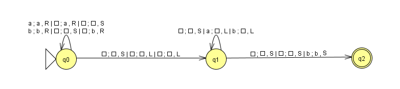
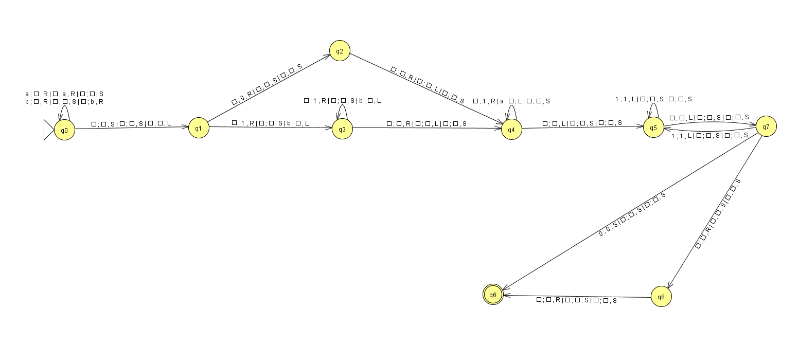

# Práctica 3 Complejidad Computacional: Implementación de la Máquina de Turing determinista
## Autor
* Nombre: Juan Rodríguez Suárez
* Correo: [alu0101477596@ull.edu.es](alu0101477596@ull.edu.es)
## Requerimientos
* **g++:** Para compilar código C++17.
* **make:** Para ejecutar el archivo *Makefile*.
## Dependencias
Este proyecto utiliza la biblioteca `nlohmann/json` para manipular datos en formato JSON y ya se encuentra incluida en el directorio *include*. Para más información, visite los siguientes enlaces:

- [nlohmann/json](https://github.com/nlohmann/json)
- Licencia MIT: https://opensource.org/licenses/MIT
## Ejecución
**1.** Para compilar el programa, ejecute el siguiente comando:
```bash
make
```
**2.** Para ejecutar el programa, ejecute el siguiente comando:
```bash
./main <DTMFileName>
```
* Donde *\<DTMFileName\>* es el nombre del fichero JSON que contiene la definición de la máquina de Turing.

**3.** El programa le pedirá que introduzca cadenas de entrada para la máquina de Turing hasta que introduzca *nada* (presionar *Enter* sin escribir nada).

**4.** El programa le mostrará si la cadena de entrada es aceptada o rechazada por la MT y el contenido de las cintas.

**5.** Para limpiar los archivos generados por el programa, ejecute el siguiente comando:
```bash
make clean
```
## Descripción
Una máquina de Turing es una 7-tupla M = (Q, Σ, Γ, δ, q0, B, F), donde:
* Q es un conjunto finito de estados.
* Σ es un conjunto finito de símbolos de entrada.
* Γ es un conjunto finito de símbolos de cinta.
* δ: Q × Γ^k^ → Q × (Γ x {L, R, S})^k^ es la función de transición.
* q0 ∈ Q es el estado inicial.
* B ∈ Γ es el símbolo de blanco.
* F ⊆ Q es el conjunto de estados finales.

- Representa un modelo de computación teórico donde a partir del estado inicial q0 y una cinta infinita con un símbolo de entrada en cada casilla, la máquina de Turing puede leer un símbolo de la cinta, escribir un símbolo en la cinta, moverse a la izquierda o a la derecha y cambiar de estado. La máquina de Turing acepta una cadena de entrada si, al finalizar la ejecución, se encuentra en un estado final. En caso contrario, la rechaza.

- Es importante destacar que la máquina implementada es **determinista**. Esto significa que, para cada estado y símbolo de cinta, existe una única transición posible. En caso de que no exista una transición definida, la máquina se detiene. **No se permiten epsilon-transiciones**.

### Características de la implementación
* La máquina de Turing **es multi-cinta**.
* La máquina de Turing **acepta el movimiento de parada (S)**.
* La cinta es **infinita en ambos sentidos**.
* Los **movimientos** como las **escrituras son simultáneos**, es decir, se realizan en una misma transición.

## Máquinas de ejemplo
Se han desarrollado las dos máquinas pedidas en el programa JFLAP (ficheros ubicados en *examples/jflap*) con **tres cintas**. A continuación, se muestran las imágenes de las máquinas de Turing desarrolladas en JFLAP:
- **Máquina de Turing para el lenguaje L = { a^n^b^m^ | m > n, n ≥ 0 }**
* Q = {q0, q1, q2}
* Σ = {a, b}
* Γ = {a, b, .}
* q0 ∈ Q = q0
* B ∈ Γ = .
* F ⊆ Q = {q2}
* δ: Q × Γ^3^ → Q × (Γ x {L, R, S})^3^

------------
- **Máquina de Turing para el lenguaje que deja en la cinta de entrada el número de *a*'s y *b*'s que contiene la cadena de entrada y el cabezal se encuentre en el primer símbolo al final.**
* Q = {q0, q1, q2, q3, q4, q5, q7, q8}
* Σ = {a, b, 1, 0}
* Γ = {a, b, 1, 0, .}
* q0 ∈ Q = q0
* B ∈ Γ = .
* F ⊆ Q = {q6}
* δ: Q × Γ^3^ → Q × (Γ x {L, R, S})^3^

------------
Estas máquinas están descritas en **formato JSON** en los ficheros *examples/mt\*.json*, cuya definición es bastante intuitiva siguiendo esos ejemplos. El programa ignorará el contenido del atributo *description*.